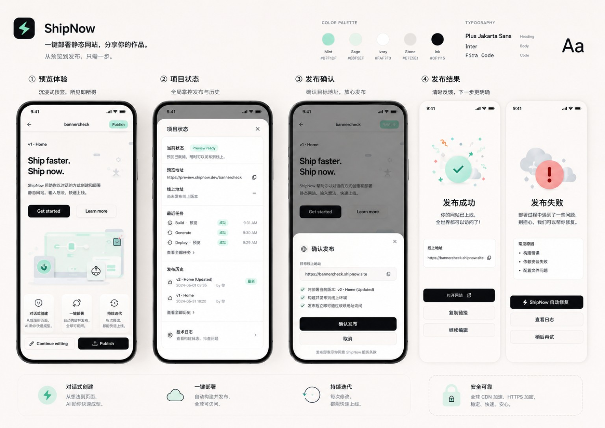
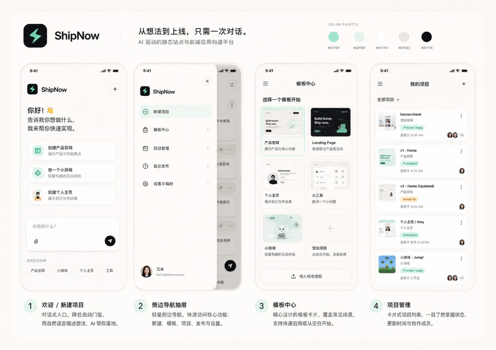
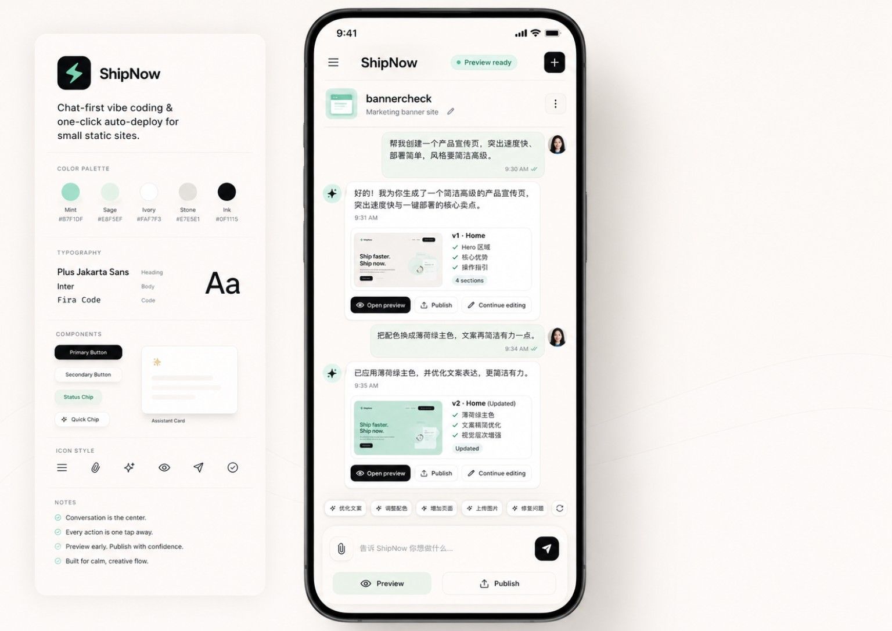
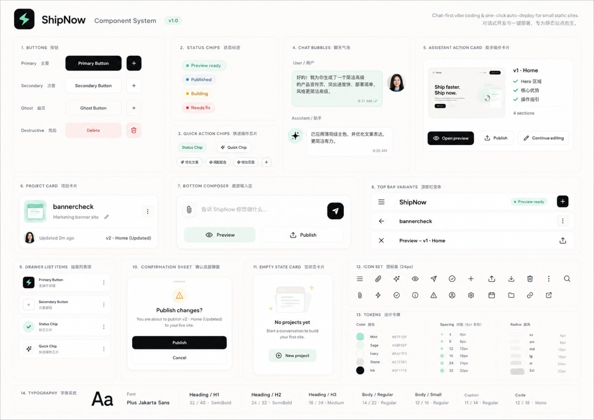
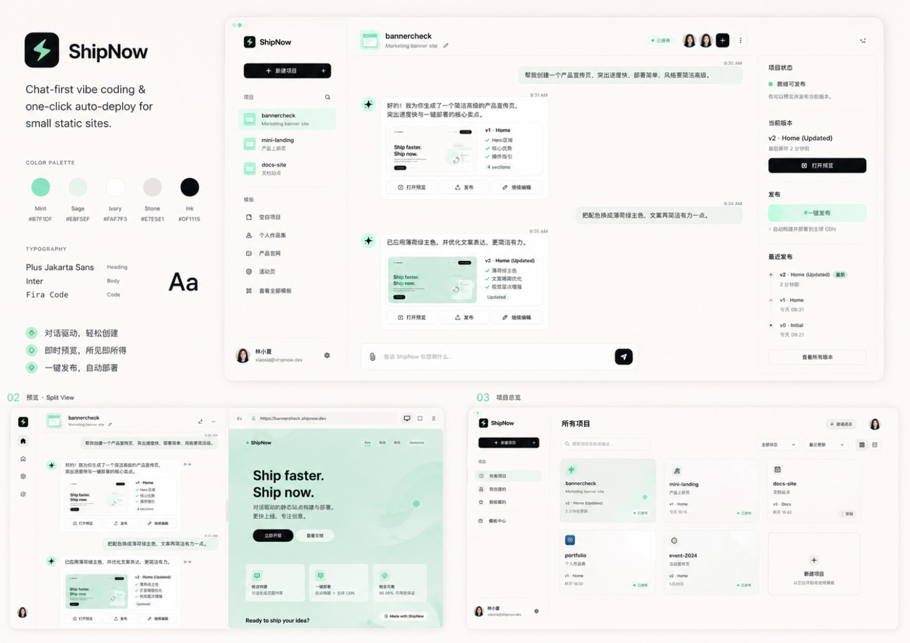

# ShipNow UI 与交互重构详细方案

版本：v1.1  
项目：ShipNow  
定位：对话式 vibe coding + 自动预览 + 一键发布工具  
适用阶段：第一版正式产品形态，不做临时后台版，不做过渡设计  
新增内容：UI 设计图使用说明、关键页面视觉参考、组件落地指引

---

## 1. 重构结论

ShipNow 当前页面更像“项目管理后台 / 运维 dashboard”，不符合目标产品心智。

ShipNow 应该被重构为一个 **chat-first 的用户端工作台**：用户通过对话创建项目、持续修改项目，通过固定的主操作完成预览与发布；项目列表、运行状态、日志、路径、失败原因、发布记录等信息收纳到侧边抽屉或高级入口中。

核心转变：

```text
从：Dashboard-first 管理后台
到：Chat-first 创建与发布工作台
```

ShipNow 的主界面不应该围绕系统指标设计，而应该围绕用户下一步动作设计。

用户每一刻只关心：

```text
我现在在做哪个项目？
我能不能马上看到效果？
我还能怎么改？
能不能一键发布？
发布后在哪里看？
失败了能不能自动修？
```

所以页面中的所有元素，都必须服务于这几个问题。

---

## 2. 当前页面主要问题

从当前手机截图来看，问题集中在四类。

### 2.1 产品心智错误

当前页面第一眼展示的是：

- Projects 数量
- Active 数量
- Published 数量
- Failed 数量
- Workspace 路径
- API 地址
- 项目表格
- Source 路径
- Task Status
- Latest Task
- Logs / Releases / Tasks

这些信息属于系统内部视角，不属于普通用户主流程。

用户想要的是：

```text
我说一句话，它帮我做站；
我再说一句话，它帮我修改；
我点一下预览；
满意后一键发布。
```

当前界面让用户感觉自己在管理构建系统，而不是在使用 AI 建站工具。

### 2.2 手机端不可用

手机端不适合展示：

- 多列项目表格
- 大量统计卡片
- 细小的状态标签
- 路径、URL、任务状态等密集文本
- 顶部横向信息条
- 多个同级操作按钮

手机端应该优先展示：

- 当前项目
- 当前状态
- 对话内容
- 输入框
- 预览按钮
- 发布按钮

### 2.3 主次信息混乱

现在“项目管理”和“当前项目编辑”混在同一个页面里。

正确结构应该是：

```text
主界面：当前项目的对话式编辑、预览、发布
左侧抽屉：多项目管理、模板、新建项目
右侧抽屉：当前项目状态、链接、任务、日志、发布记录
```

### 2.4 操作语言偏工程化

当前页面中有很多工程化表达：

- Rebuild
- Apply change
- Latest Task
- Task Status
- Source
- Build failed
- Last Built
- Last Published

普通用户更需要的是：

- 重新生成
- 应用修改
- 正在修改
- 预览已就绪
- 发布成功
- 自动修复
- 查看技术日志

---

## 3. 重构目标

### 3.1 产品目标

把 ShipNow 做成一个普通用户也能顺畅使用的 AI 建站与发布工具。

用户可以完成完整闭环：

```text
创建项目 → 对话修改 → 查看预览 → 继续修改 → 一键发布 → 获取线上链接
```

不需要理解：

- 工作区路径
- 构建任务
- 源码目录
- 任务队列
- API endpoint
- 发布流水线
- 内部日志

这些信息可以存在，但不能暴露在主界面。

### 3.2 体验目标

ShipNow 的体验关键词：

```text
轻量
直接
创作感
AI 工作台
移动端可用
少配置
少后台感
一键看到结果
```

### 3.3 界面目标

主界面应该像：

```text
ChatGPT / Claude 的对话工作区
+ Vercel 的部署清爽感
+ Raycast 的轻量入口感
+ Linear 的克制高级感
```

不应该像：

```text
低配项目管理后台
低配 CI/CD Dashboard
低配 Vercel Admin Panel
```

---

## 4. 核心产品原则

### 4.1 对话是主界面

用户进入项目后，第一视觉中心必须是对话流。

对话负责：

- 创建项目
- 修改项目
- 解释变更
- 引导下一步
- 自动修复失败
- 推荐后续优化

### 4.2 预览和发布是主操作

预览、发布必须始终可见，不能藏在二级页面。

尤其在手机端：

```text
底部输入区必须长期保留：预览 / 发布 / 发送
```

### 4.3 系统信息默认收纳

以下信息默认不出现在主界面：

- workspace path
- source path
- API URL
- last built
- latest task
- task status
- failed count
- active count
- build log
- release detail
- internal project ID

这些信息放入右侧抽屉或高级入口。

### 4.4 移动端优先

手机端不是桌面端缩小版。

手机端必须取消：

- 表格
- 多列统计卡片
- 横向密集按钮组
- 同屏过多信息

改为：

- 顶部项目栏
- 中间对话流
- 底部固定输入框
- 左右抽屉
- 卡片式项目列表

### 4.5 用户语言优先

工程状态要转换为用户可理解语言。

示例：

| 内部状态 | 用户可见表达 |
|---|---|
| build_failed | 修改失败 |
| preview_ready | 预览已就绪 |
| publishing | 正在发布 |
| published | 已上线 |
| task_running | 正在处理 |
| source_path | 项目文件 |
| rebuild | 重新生成 |
| apply change | 应用修改 |

---

## 5. 信息架构 IA

ShipNow 页面结构重构为三层。

```text
App Shell
├── 左侧抽屉：项目与模板
├── 中央主工作区：对话式创建 / 修改 / 预览 / 发布
└── 右侧抽屉：当前项目状态与高级信息
```

### 5.1 左侧抽屉：跨项目管理

左侧抽屉负责“我有哪些项目”。

包含：

1. 新建项目
2. 模板库
3. 项目列表
4. 最近发布
5. 设置

不在主界面展示项目表格。

项目列表以卡片展示：

```text
bannercheck
预览已就绪 · 5分钟前修改

Digital Fish
修改失败 · 可自动修复

Hello ShipNow
已上线 · boringmax.com/hello-shipnow
```

### 5.2 中央主工作区：当前项目

中央区域是 ShipNow 的核心。

包含：

1. 顶部当前项目栏
2. 对话消息流
3. 变更结果卡片
4. 快捷建议 chips
5. 底部固定输入框
6. 预览 / 发布主按钮

### 5.3 右侧抽屉：当前项目状态

右侧抽屉负责“当前项目发生了什么”。

包含：

1. 当前状态
2. 预览地址
3. 线上地址
4. 最近任务
5. 发布记录
6. 构建日志
7. 项目设置
8. 删除项目

右侧抽屉不是主流程，只是辅助查看。

---

## 6. 路由与页面结构

建议保留简单路由，不做复杂多页面后台。

### 6.1 页面路由

```text
/shipnow
  未选择项目时的首页 / 新建入口

/shipnow/project/:projectName
  当前项目工作台

/shipnow/preview/:projectName
  全屏预览页，可选

/shipnow/settings
  设置页，可选，第一版可收纳在抽屉中
```

### 6.2 页面职责

| 页面 | 职责 |
|---|---|
| /shipnow | 创建项目、选择模板、打开最近项目 |
| /shipnow/project/:projectName | 对话编辑、预览、发布 |
| /shipnow/preview/:projectName | 全屏查看当前预览 |
| /shipnow/settings | 基础设置，不作为主流程 |

---

## 7. 桌面端布局方案

桌面端采用三栏结构，但默认突出中间对话区。

```text
┌──────────────────────────────────────────────────────────────┐
│ ShipNow                                      New Project      │
├───────────────┬────────────────────────────────┬─────────────┤
│ 左侧项目栏     │ 当前项目对话工作区              │ 右侧状态栏   │
│               │                                │             │
│ + 新建项目     │ bannercheck      预览已就绪      │ 当前状态      │
│ 模板库         │                                │ 预览地址      │
│ 项目列表       │ 用户：帮我创建一个...            │ 线上地址      │
│               │ AI：已创建项目...               │ 最近任务      │
│ bannercheck    │ [打开预览] [发布]               │ 发布记录      │
│ digital-fish   │                                │ 日志入口      │
│ hello-shipnow  │ 输入框...                       │             │
└───────────────┴────────────────────────────────┴─────────────┘
```

### 7.1 桌面端默认状态

- 左侧栏默认展开，但宽度轻量，不超过 260px。
- 右侧栏默认可折叠。
- 中央对话区占最大宽度。
- 顶部不再展示大面积统计卡片。

### 7.2 桌面端建议尺寸

```text
左侧栏：240px - 280px
中间区：自适应，最小 640px
右侧栏：300px - 360px，可折叠
顶部栏：56px - 64px
底部输入区：88px - 140px
```

---

## 8. 手机端布局方案

手机端必须是单列 chat-first。

```text
┌──────────────────────────────┐
│ ☰  bannercheck        状态 ▸ │
│ 预览已就绪                   │
├──────────────────────────────┤
│                              │
│ 用户：帮我创建一个...         │
│                              │
│ ShipNow：已创建项目。         │
│ [打开预览] [发布]             │
│                              │
│ 用户：把风格改高级一点        │
│                              │
│ ShipNow：已完成修改。         │
│ [打开预览] [继续修改] [发布]   │
│                              │
├──────────────────────────────┤
│ + 输入你的修改需求...         │
│ [预览] [发布] [发送]          │
└──────────────────────────────┘
```

### 8.1 手机端顶部栏

顶部栏只保留：

```text
☰  当前项目名  当前状态 / 详情按钮
```

示例：

```text
☰ bannercheck      预览已就绪 ▸
```

点击左侧菜单：打开项目抽屉。  
点击状态：打开当前项目状态抽屉。

### 8.2 手机端底部输入区

底部固定，不随滚动消失。

结构：

```text
输入框：告诉 ShipNow 你想怎么改...
按钮：附件 / 预览 / 发布 / 发送
```

输入区应该支持多行，但最大高度有限，避免遮挡对话。

建议：

```text
默认高度：72px - 88px
展开最大高度：160px
```

### 8.3 手机端禁止项

手机端不允许出现：

- 多列项目表格
- 大面积统计卡片
- workspace/API/source 路径
- 同屏四个以上主按钮
- 细小难点的文字链接
- 需要横向滚动的布局

---

## 9. 首页 / 未选择项目状态

当用户首次进入 `/shipnow` 或未选择项目时，展示创建入口，而不是 dashboard。

### 9.1 首页结构

```text
ShipNow
用一句话创建、修改、预览并发布一个小网站。

你想做什么？
[产品官网] [个人主页] [小游戏] [工具站] [活动页]

输入框：
帮我做一个极简风格的 SaaS 官网，包含首页、价格页和 FAQ

最近项目
- bannercheck
- digital-fish
- hello-shipnow
```

### 9.2 首页主输入框

首页输入框是创建项目的入口。

placeholder：

```text
描述你想创建的网站，例如：做一个极简风格的产品官网，包含首页、价格页和 FAQ
```

### 9.3 模板 chips

模板不是复杂表单，只是辅助用户开始。

第一版模板建议：

1. 产品官网
2. 个人主页
3. 小游戏
4. 工具站
5. 活动落地页
6. 空白项目

点击模板后，在输入框中预填 prompt，而不是跳转复杂配置页。

示例：

```text
帮我创建一个产品官网，风格简洁高级，包含 Hero、功能介绍、使用场景、价格区和 FAQ。
```

---

## 10. 当前项目工作台

当前项目工作台是 ShipNow 的核心页面。

### 10.1 顶部项目栏

桌面端：

```text
bannercheck        预览已就绪        [打开预览] [发布]
```

手机端：

```text
☰ bannercheck        预览已就绪 ▸
```

顶部项目栏展示最少信息：

- 项目名
- 当前状态
- 预览按钮
- 发布按钮

不要展示：

- workspace
- API
- source path
- task ID

### 10.2 对话消息流

消息类型分为：

1. 用户需求消息
2. ShipNow 回复消息
3. 系统执行状态消息
4. 变更结果卡片
5. 错误修复卡片
6. 发布成功卡片

#### 用户消息示例

```text
把整体风格改得更高级一点，按钮不要太粉嫩。
```

#### ShipNow 回复示例

```text
已收到。我会调整整体视觉风格、按钮颜色和移动端间距，然后重新生成预览。
```

#### 执行中状态

```text
正在修改项目...
```

#### 变更结果卡片

```text
已完成修改

本次变更：
- 调整首页视觉层级
- 优化按钮颜色和圆角
- 改善手机端间距

[打开预览] [继续修改] [发布]
```

### 10.3 底部输入框

底部输入框是持续编辑入口。

placeholder：

```text
告诉 ShipNow 你想怎么改...
```

支持能力：

- 输入自然语言修改需求
- 上传图片或素材
- 快捷 chips
- 发送
- 预览
- 发布

建议按钮结构：

```text
左侧：+ / 上传素材
中间：输入框
右侧：发送
下方或右侧：预览 / 发布
```

手机端可以简化成：

```text
[+] 输入你的修改需求... [发送]
[预览] [发布]
```

---

## 11. 快捷操作设计

快捷操作不是主流程，但可以提升效率。

### 11.1 输入框上方 chips

根据项目状态动态展示。

新项目阶段：

```text
优化首页
添加价格页
换一种风格
上传 Logo
```

预览已就绪：

```text
打开预览
继续修改
发布上线
```

构建失败：

```text
自动修复
重新生成
查看日志
```

已发布：

```text
复制链接
继续修改
再次发布
查看发布记录
```

### 11.2 消息卡片按钮

每次 ShipNow 完成操作后，在结果卡片中给出下一步按钮。

例如：

```text
已完成创建
[打开预览] [继续修改] [发布]
```

```text
发布成功
[打开网站] [复制链接] [继续修改]
```

```text
修改失败
[自动修复] [重新生成] [查看技术日志]
```

---

## 12. 创建项目流程

### 12.1 标准流程

```text
用户进入首页
→ 输入一句话需求
→ 可选选择模板
→ 点击创建
→ ShipNow 创建项目
→ 自动生成第一版
→ 自动生成预览
→ 进入当前项目工作台
```

### 12.2 用户输入示例

```text
帮我做一个极简风格的 SaaS 官网，包含首页、价格页和 FAQ，风格参考 Linear，不要太花哨。
```

### 12.3 系统反馈

```text
已开始创建项目

我会先生成：
- 首页结构
- 基础视觉风格
- 价格页
- FAQ
- 移动端适配

生成完成后会自动提供预览。
```

### 12.4 创建完成卡片

```text
项目已创建

项目名：linear-saas-demo
预览已就绪。

[打开预览] [继续修改] [发布]
```

### 12.5 项目命名

项目名可以自动生成，允许用户后续修改。

命名规则：

```text
英文小写
短横线连接
不超过 32 个字符
不能包含空格和特殊符号
```

如果用户没有指定项目名，由系统根据需求生成。

---

## 13. 持续编辑流程

### 13.1 标准流程

```text
用户输入修改需求
→ ShipNow 确认理解
→ 执行修改
→ 自动重新生成预览
→ 返回变更摘要
→ 用户打开预览 / 继续修改 / 发布
```

### 13.2 编辑请求示例

```text
把整体风格改得更高级一点，不要太可爱，按钮颜色换成黑色，移动端间距再舒服一点。
```

### 13.3 执行中状态

```text
正在修改项目...
预计会更新视觉风格、按钮样式和移动端布局。
```

不要显示 raw build log。

### 13.4 完成状态

```text
已完成修改

本次变更：
- 调整整体配色为更克制的黑白灰
- 优化按钮视觉层级
- 增加移动端内容间距
- 重新生成预览

[打开预览] [继续修改] [发布]
```

### 13.5 连续编辑体验

每次修改后，不需要用户重新选择项目。  
输入框始终针对当前项目生效。

---

## 14. 预览流程

### 14.1 预览入口

预览是高频动作，入口必须始终可见。

入口位置：

- 顶部项目栏
- 底部输入区
- 结果卡片按钮
- 右侧状态抽屉

### 14.2 预览打开方式

桌面端建议：

- 默认新标签页打开预览地址
- 可选右侧内嵌预览面板

手机端建议：

- 打开全屏预览页
- 顶部保留返回编辑按钮

手机端预览页：

```text
┌──────────────────────────────┐
│ ← 返回编辑   bannercheck  发布 │
├──────────────────────────────┤
│                              │
│        网站预览内容           │
│                              │
├──────────────────────────────┤
│ [继续修改] [发布]             │
└──────────────────────────────┘
```

### 14.3 预览地址规则

预览地址使用：

```text
https://preview.boringmax.com/{projectName}
```

不要在主界面展示完整 URL，除非用户点击“复制预览链接”或进入状态抽屉。

主界面文案：

```text
预览已就绪
[打开预览]
```

---

## 15. 发布流程

### 15.1 发布入口

发布按钮必须常驻，但需要根据状态控制可用性。

可发布状态：

```text
preview_ready
published_but_has_changes
```

不可发布状态：

```text
generating
building
build_failed
publishing
```

### 15.2 发布前确认

发布前弹出轻量确认，不要复杂。

```text
发布项目

即将发布到：
boringmax.com/bannercheck

发布后，访问者将看到当前预览版本。

[取消] [确认发布]
```

### 15.3 发布中状态

```text
正在发布...
通常只需要几秒钟。
```

### 15.4 发布成功

```text
发布成功

你的站点已经上线：
boringmax.com/bannercheck

[打开网站] [复制链接] [继续修改]
```

### 15.5 发布失败

发布失败时，不直接显示 raw log。

```text
发布失败

ShipNow 没能完成本次发布。可能是构建过程中出现了样式或页面错误。

你可以让 ShipNow 自动尝试修复。

[自动修复] [重新发布] [查看技术日志]
```

技术日志只在用户点击后展示。

---

## 16. 错误与自动修复流程

### 16.1 错误状态原则

错误提示必须做到：

```text
用户可理解
给出下一步
默认自动修复
高级日志收纳
```

不要把用户丢进日志里。

### 16.2 构建失败卡片

```text
修改失败

这次修改没有成功生成预览。ShipNow 可以尝试自动修复。

建议操作：
- 自动修复构建问题
- 回到上一个可预览版本
- 查看技术日志

[自动修复] [恢复上一版] [查看技术日志]
```

### 16.3 自动修复流程

```text
用户点击自动修复
→ ShipNow 根据错误摘要生成修复任务
→ 执行修复
→ 自动重新构建
→ 成功后返回预览
```

成功反馈：

```text
已完成自动修复

我修复了导致预览失败的问题，并重新生成了预览。

[打开预览] [继续修改] [发布]
```

失败反馈：

```text
自动修复未完成

这次问题需要更具体的处理。你可以查看技术日志，或让 ShipNow 尝试回退到上一版。

[恢复上一版] [查看技术日志]
```

---

## 17. 左侧抽屉详细设计

### 17.1 左侧抽屉入口

手机端：顶部左侧汉堡按钮。  
桌面端：左侧栏默认展示，可折叠。

### 17.2 左侧抽屉结构

```text
ShipNow

[+ 新建项目]

模板
- 产品官网
- 个人主页
- 小游戏
- 工具站
- 活动页

项目
- bannercheck
- digital-fish
- hello-shipnow
- vps-accept-20260525

设置
```

### 17.3 项目卡片样式

```text
bannercheck
修改失败 · 12分钟前

[打开]
```

状态颜色轻量，不要过重：

- 预览已就绪：绿色 / 青色轻标签
- 正在处理：蓝色 / 中性色轻标签
- 修改失败：红色轻标签，但不要过度警告
- 已上线：深色或绿色轻标签

### 17.4 新建项目按钮

点击后打开首页创建状态或新建项目弹层。

手机端建议直接进入新建项目界面。

---

## 18. 右侧抽屉详细设计

### 18.1 右侧抽屉入口

手机端：点击顶部状态文字或 `详情`。  
桌面端：右侧状态栏默认可见或可折叠。

### 18.2 右侧抽屉结构

```text
项目状态
预览已就绪

链接
预览：preview.boringmax.com/bannercheck
线上：boringmax.com/bannercheck

最近任务
- 已完成修改 · 2分钟前
- 发布成功 · 12分钟前
- 自动修复失败 · 昨天

发布记录
- v3 · 当前线上版本
- v2 · 上一版

高级
- 查看技术日志
- 项目文件
- 删除项目
```

### 18.3 高级信息默认折叠

以下信息只能在高级区域出现：

- source path
- workspace path
- raw logs
- task ID
- build command
- internal API URL

默认不展开。

---

## 19. 状态系统设计

### 19.1 用户可见状态

ShipNow 主界面只使用以下用户可见状态：

| 状态 | 含义 | 用户可操作 |
|---|---|---|
| 未创建 | 还没有项目 | 创建项目 |
| 正在创建 | 正在生成第一版 | 等待 / 取消 |
| 预览已就绪 | 可以查看预览 | 预览 / 修改 / 发布 |
| 正在修改 | 正在应用用户修改 | 等待 |
| 修改失败 | 未能生成新预览 | 自动修复 / 恢复上一版 |
| 正在发布 | 正在上线 | 等待 |
| 已上线 | 线上版本可访问 | 打开网站 / 继续修改 |
| 有未发布修改 | 预览版本新于线上版本 | 发布 / 继续修改 |
| 发布失败 | 上线失败 | 自动修复 / 重新发布 |

### 19.2 状态映射

内部可以保留工程状态，但要映射为用户状态。

| 内部状态 | 用户状态 |
|---|---|
| idle_no_project | 未创建 |
| generating | 正在创建 / 正在修改 |
| build_running | 正在修改 |
| preview_ready | 预览已就绪 |
| build_failed | 修改失败 |
| publish_running | 正在发布 |
| published | 已上线 |
| publish_failed | 发布失败 |
| preview_newer_than_public | 有未发布修改 |

---

## 20. 文案规范

### 20.1 总体文案风格

ShipNow 的文案应该：

```text
自然
明确
少工程感
不装饰过度
不使用太多术语
```

### 20.2 常用文案

| 场景 | 推荐文案 |
|---|---|
| 首页标题 | 用一句话创建并发布一个小网站 |
| 首页副标题 | ShipNow 会帮你生成、修改、预览并发布到 boringmax.com |
| 输入框 | 告诉 ShipNow 你想做什么... |
| 项目输入框 | 告诉 ShipNow 你想怎么改... |
| 创建中 | 正在创建项目... |
| 修改中 | 正在修改项目... |
| 预览完成 | 预览已就绪 |
| 发布中 | 正在发布... |
| 发布成功 | 发布成功，你的网站已经上线 |
| 失败 | 这次没有成功，可以让 ShipNow 自动修复 |
| 日志入口 | 查看技术日志 |

### 20.3 避免文案

避免在主界面出现：

```text
workspace
source
task
build
pipeline
API endpoint
status code
last built
last published
```

这些词可以放到高级区域。

---

## 21. 视觉风格方向

### 21.1 总体风格

推荐风格：

```text
浅色为主
低饱和
轻卡片
大留白
细边框
圆角适中
重点按钮黑色或深色
状态颜色克制
```

### 21.2 避免风格

避免：

- 后台 dashboard 风格
- 大面积统计卡片
- 太多小标签
- 表格密集布局
- 过度玻璃拟态
- 过度渐变
- 过度科技风

### 21.3 设计关键词

```text
干净
轻盈
高级
创作工具感
AI 对话感
一键发布感
```

### 21.4 色彩建议

第一版可以使用极简色彩：

```text
背景：#F7F6F2 / #FAFAF8
主文本：#111111
次文本：#666666
边框：#E8E4DC
主按钮：#111111
主按钮文字：#FFFFFF
成功状态：低饱和绿色
失败状态：低饱和红色
处理中状态：低饱和蓝灰
```

不要使用过强的彩色 dashboard 卡片。

---

## 22. 核心组件清单

Codex 可以按组件拆分实现。

### 22.1 AppShell

职责：

- 页面基础布局
- 左右抽屉控制
- 响应式布局
- 顶部栏
- 当前项目上下文

### 22.2 ProjectSidebar

职责：

- 新建项目
- 模板入口
- 项目列表
- 最近项目

### 22.3 ProjectStatusDrawer

职责：

- 当前状态
- 预览链接
- 线上链接
- 最近任务
- 发布记录
- 技术日志入口

### 22.4 ChatWorkspace

职责：

- 当前项目对话流
- 消息渲染
- 执行状态
- 结果卡片
- 快捷操作

### 22.5 Composer

职责：

- 多行输入
- 发送修改需求
- 上传素材入口
- 预览按钮
- 发布按钮

### 22.6 ProjectHome

职责：

- 未选择项目时的新建入口
- 模板 chips
- 最近项目

### 22.7 PreviewView

职责：

- 打开预览
- 手机端全屏预览
- 返回编辑
- 发布入口

### 22.8 StatusBadge

职责：

- 统一状态展示
- 内部状态到用户状态映射

### 22.9 ResultCard

职责：

- 创建完成卡片
- 修改完成卡片
- 发布成功卡片
- 失败修复卡片

---

## 23. 数据展示原则

### 23.1 主界面只展示用户需要的信息

主界面允许展示：

- 项目名
- 用户状态
- 对话内容
- 本次变更摘要
- 预览按钮
- 发布按钮
- 线上链接成功提示

### 23.2 抽屉展示辅助信息

右侧抽屉允许展示：

- 预览地址
- 线上地址
- 最近任务
- 发布记录
- 日志入口

### 23.3 高级区域展示工程信息

高级区域允许展示：

- workspace path
- source path
- API endpoint
- raw logs
- task ID
- build command

这些信息默认折叠。

---

## 24. 交互细节

### 24.1 发送消息后

用户点击发送后：

1. 用户消息立即出现在对话流中。
2. 输入框清空。
3. ShipNow 显示理解与执行状态。
4. 预览和发布按钮进入相应禁用状态。
5. 任务完成后追加结果卡片。

### 24.2 正在执行时

执行中允许：

- 查看当前对话
- 查看旧预览
- 打开项目状态抽屉

执行中禁用：

- 再次发送修改，或提示排队
- 发布当前未完成版本

### 24.3 多次修改处理

第一版建议：正在处理时不允许并行修改。

文案：

```text
ShipNow 正在处理上一次修改，完成后就可以继续输入。
```

后续版本再考虑任务队列。

### 24.4 删除项目

删除项目是低频危险操作，只放到右侧抽屉高级区域。

需要二次确认：

```text
删除项目 bannercheck？
删除后将无法在 ShipNow 中继续管理该项目。

[取消] [确认删除]
```

---

## 25. 响应式规则

### 25.1 Breakpoints

```text
mobile: < 768px
tablet: 768px - 1024px
desktop: > 1024px
```

### 25.2 Mobile

- 单列布局
- 左右抽屉覆盖式打开
- 无表格
- 底部固定输入区
- 预览全屏打开

### 25.3 Tablet

- 默认单列或窄双栏
- 左侧项目栏可抽屉化
- 右侧状态栏默认收起

### 25.4 Desktop

- 三栏布局
- 左侧项目栏可常驻
- 右侧状态栏可常驻或折叠
- 中间对话区最大化

---

## 26. 版本与发布记录设计

第一版不需要做复杂版本管理，但需要让用户理解“线上版本”和“当前预览版本”的区别。

### 26.1 有未发布修改

当用户修改后生成了新预览，但还没发布：

```text
有未发布修改
当前预览版本还没有上线。

[打开预览] [发布]
```

### 26.2 发布记录

右侧抽屉中展示轻量发布记录：

```text
发布记录

v4 当前线上版本 · 今天 00:44
v3 上一版 · 昨天 23:10
v2 · 昨天 22:58
```

第一版可以不做回滚，或只做入口占位。  
如果做回滚，需要明确为高级功能，不进入主流程。

---

## 27. 空状态设计

### 27.1 没有项目

```text
还没有项目

用一句话创建你的第一个小网站。

[创建产品官网] [创建小游戏] [创建个人主页]
```

### 27.2 当前项目无对话记录

```text
这个项目还没有修改记录

你可以直接告诉 ShipNow 想怎么改。
```

### 27.3 没有发布记录

```text
还没有发布记录

预览满意后，可以一键发布到 boringmax.com。
```

---

## 28. 加载与骨架屏

### 28.1 首次加载

不要显示空白后台。

显示：

```text
正在打开 ShipNow...
```

### 28.2 项目加载

```text
正在打开项目...
```

### 28.3 对话执行中

使用消息流内的执行状态，不要弹全屏 loading。

```text
正在修改项目...
```

---

## 29. 可访问性与手机可用性要求

### 29.1 触控区域

手机端按钮最小触控高度：44px。

### 29.2 字号

手机端正文不小于 14px。  
主按钮不小于 14px。  
辅助说明不小于 12px。

### 29.3 对比度

主文本与背景保持清晰对比。  
状态标签不能只依赖颜色表达，也要有文字。

### 29.4 键盘适配

手机端输入框被键盘顶起时：

- 对话流自动保留底部 padding
- 输入框不遮挡最后一条消息
- 发送按钮始终可见

---

## 30. 第一版保留与移除

### 30.1 主界面保留

保留：

- 当前项目名
- 当前项目状态
- 对话输入
- 对话历史
- 预览按钮
- 发布按钮
- 变更摘要
- 错误修复入口

### 30.2 从主界面移除

移除或收纳：

- Projects / Active / Failed 统计卡片
- 项目表格
- Workspace 路径
- API URL
- Source 路径
- Last Built
- Last Published
- Latest Task
- Task Status
- Logs tabs
- Releases tabs
- Tasks tabs

这些可以进入侧边抽屉或高级信息区。

### 30.3 暂不需要做

第一版不强求：

- 多人协作
- 完整版本回滚
- 复杂模板市场
- 多环境管理
- 权限系统
- 任务队列可视化
- 复杂统计 dashboard

---

## 31. Codex 实施建议

### 31.1 改造优先级

按以下顺序实现：

1. 建立新的 AppShell：移动端单列 + 桌面端三栏。
2. 移除首页 dashboard 统计卡片和项目表格。
3. 实现 ProjectHome：一句话创建项目 + 模板 chips + 最近项目。
4. 实现 ProjectWorkspace：当前项目对话流 + 底部输入框。
5. 实现 Preview / Publish 主按钮。
6. 实现左侧项目抽屉。
7. 实现右侧状态抽屉。
8. 实现状态映射与用户文案。
9. 将日志、路径、任务等工程信息移入高级区域。
10. 优化手机端触控、键盘、滚动体验。

### 31.2 不要让 Codex 自由发挥的地方

必须明确：

- 不要继续做 dashboard-first。
- 不要在手机端使用项目表格。
- 不要把系统路径和 API 地址放在主界面。
- 不要把任务日志作为默认可见内容。
- 不要让预览和发布入口消失。
- 不要把创建项目做成复杂表单。
- 不要做过渡版本 UI。

### 31.3 Codex 可以自由发挥的地方

可以让 Codex 根据当前技术栈决定：

- 组件文件拆分
- CSS 实现方式
- 状态管理方式
- 抽屉实现方式
- 响应式细节
- API 调用封装

但最终产品效果必须符合本方案。

---

## 32. 验收标准

### 32.1 产品流程验收

用户必须可以在手机上完成：

```text
进入 ShipNow
→ 创建一个项目
→ 输入修改需求
→ 查看预览
→ 继续修改
→ 一键发布
→ 打开线上链接
```

全流程不需要理解工程概念。

### 32.2 手机端验收

手机端必须满足：

- 无项目表格
- 无横向滚动
- 输入框固定在底部
- 预览 / 发布按钮始终容易找到
- 左侧项目管理可通过抽屉打开
- 当前项目状态可通过右侧抽屉打开
- 工程日志不默认展示

### 32.3 桌面端验收

桌面端必须满足：

- 中央对话工作区是视觉中心
- 左侧项目栏不抢主流程
- 右侧状态栏可折叠
- 不再以统计 dashboard 作为首页主体

### 32.4 文案验收

主界面不应出现以下词汇：

```text
workspace
source path
API endpoint
task status
latest task
build command
raw log
```

除非在高级区域中。

### 32.5 状态验收

任何失败状态必须提供下一步按钮：

```text
自动修复
恢复上一版
查看技术日志
重新发布
```

不能只显示失败。

---

## 33. 最终目标画面

### 33.1 首页目标画面

```text
ShipNow
用一句话创建、修改、预览并发布一个小网站。

你想做什么？
[产品官网] [个人主页] [小游戏] [工具站] [活动页]

┌──────────────────────────────┐
│ 描述你想创建的网站...          │
│                              │
│                      [创建]   │
└──────────────────────────────┘

最近项目
bannercheck     预览已就绪
Digital Fish    修改失败，可修复
Hello ShipNow   已上线
```

### 33.2 项目工作台目标画面

```text
☰ bannercheck                      预览已就绪 ▸

用户：帮我创建一个小型演示站，主题是夜航灯塔。

ShipNow：已创建项目，我生成了首页结构、视觉风格和基础内容。
[打开预览] [继续修改] [发布]

用户：把整体风格改得更高级一点，不要太粉嫩。

ShipNow：已完成修改。
本次变更：
- 调整整体配色
- 优化移动端间距
- 更新按钮样式
[打开预览] [发布]

------------------------------------------------
+ 告诉 ShipNow 你想怎么改...          [发送]
[预览] [发布]
```

### 33.3 状态抽屉目标画面

```text
项目状态
预览已就绪

链接
预览：preview.boringmax.com/bannercheck
线上：boringmax.com/bannercheck

最近任务
已完成修改 · 2分钟前
发布成功 · 12分钟前

高级
查看技术日志
项目文件
删除项目
```

---

## 34. UI 设计图使用说明与交付清单

本次 UI 图是 ShipNow 的最终视觉标准，用来统一产品心智、页面结构、组件风格和移动端优先体验。

使用优先级：

```text
产品逻辑以本文档为准
视觉方向以 UI 图为准
组件细节以组件系统图为准
实现细节由 Codex 根据当前技术栈决定
```

换句话说：

```text
本文档 = 产品与交互的 source of truth
UI 图 = 视觉风格、布局结构、组件状态的参考标准
```

### 34.1 UI 图文件清单

| 文件 | 用途 | 对应落地范围 |
|---|---|---|
| `images/01_preview_publish_status_flow.png` | 预览、项目状态、发布确认、发布成功/失败流程 | PreviewView、ProjectStatusDrawer、PublishConfirm、PublishResult、FailureFixCard |
| `images/02_mobile_entry_drawer_templates_projects.png` | 移动端欢迎页、侧边抽屉、模板中心、项目管理 | ProjectHome、ProjectSidebar、TemplatePicker、ProjectList |
| `images/03_mobile_chat_workspace_hero.png` | 移动端核心对话工作台与整体视觉风格 | ChatWorkspace、Composer、ResultCard、QuickActionChips、TopBar |
| `images/04_component_system.png` | 组件系统、状态标签、按钮、气泡、卡片、图标与 tokens | Button、StatusChip、ChatBubble、AssistantActionCard、ProjectCard、BottomComposer、TopBar、DrawerItem |
| `images/05_desktop_workspace_concept.png` | 桌面端三栏工作台、分屏预览、项目总览 | DesktopAppShell、DesktopChatWorkspace、SplitPreview、ProjectOverview |

### 34.2 视觉参考图

#### 34.2.1 预览 / 状态 / 发布流程



这张图用于定义从预览到发布的完整闭环。重点参考：

- 预览页应该是沉浸式体验，而不是展示一个裸链接。
- 项目状态应该作为抽屉或侧栏出现，不进入主对话界面。
- 发布前要有轻量确认，明确目标线上地址。
- 发布成功要给用户明确反馈和下一步动作。
- 发布失败要优先提供“ShipNow 自动修复”，技术日志只作为次级入口。

对应实现时，不要把发布流程做成后台任务页面，而要做成用户能理解的发布体验。

#### 34.2.2 移动端入口 / 抽屉 / 模板 / 项目管理



这张图用于替代当前 dashboard 首页。重点参考：

- 首页从“统计面板”改为“对话式创建入口”。
- 用户可以通过一句话开始，也可以通过模板快速开始。
- 左侧抽屉只放跨项目功能：新建、模板、项目、最近发布、设置。
- 项目管理必须用卡片，不使用表格。
- 项目状态用轻量 chip 表达，避免后台感。

对应实现时，`/shipnow` 首页不再展示 Projects / Active / Failed 等统计卡片。

#### 34.2.3 移动端核心对话工作台



这张图是 ShipNow 第一版最重要的主界面参考。重点参考：

- 对话流是视觉中心。
- 当前项目名、状态、创建入口只占顶部轻量区域。
- 每次生成或修改后，ShipNow 返回一个结果卡片。
- 结果卡片包含预览缩略图、变更摘要、下一步按钮。
- 输入框固定在底部。
- 预览和发布始终一眼可见。
- 快捷 chips 围绕当前项目上下文动态出现。

这张图应该作为移动端实现的主参考。如果与其他图产生细节冲突，以这张图的主界面心智优先。

#### 34.2.4 组件系统



这张图用于统一组件和视觉规范。Codex 实现时，应优先抽象这些组件：

```text
Button
StatusChip
QuickActionChip
ChatBubble
AssistantActionCard
ProjectCard
BottomComposer
TopBar
DrawerListItem
ConfirmationSheet
EmptyStateCard
Icon
```

实现原则：

- 所有主按钮使用深色或黑色。
- 次级按钮使用白底、浅边框。
- 状态标签使用低饱和颜色，不做强烈 dashboard 色块。
- 对话气泡和卡片保持轻阴影、细边框、大圆角。
- 输入区需要固定在底部，并支持移动端键盘适配。
- 删除、失败、日志等高风险或高工程感入口弱化处理。

组件系统图是后续 UI 一致性的主要依据。

#### 34.2.5 桌面端工作台



这张图用于定义桌面端响应式布局。重点参考：

- 桌面端可以使用三栏结构：左项目栏、中间对话、右状态栏。
- 中间对话区仍然是核心，不要让项目列表或状态栏抢主流程。
- 支持分屏预览：左边对话修改，右边实时查看站点。
- 项目总览仍然使用卡片，不恢复传统表格。
- 右侧状态栏只放当前项目状态、预览、发布、最近版本。

桌面端不是重新做一个管理后台，而是对移动端 chat-first 工作台的扩展。

### 34.3 给 Codex 的图片使用规则

交给 Codex 实施时，可以在任务说明中明确：

```text
请阅读本文档，并参考 images 目录下的 5 张 UI 图。
本文档定义产品逻辑和交互优先级，UI 图定义最终视觉标准和关键页面布局。
实现时应尽量与 UI 图保持一致，包括组件、颜色、字体、切图、留白和层级关系。
必须保留 chat-first、mobile-first、preview/publish always visible 的核心体验。
```

尤其要强调：

```text
不要重新做 dashboard。
不要恢复项目表格。
不要把路径、API、任务日志放回主界面。
不要让预览和发布入口消失。
不要让创建项目变成复杂表单。
```

### 34.4 推荐实施顺序

根据这些 UI 图，推荐 Codex 按下面顺序实现：

```text
1. 先按 04_component_system.png 抽象基础组件
2. 再按 03_mobile_chat_workspace_hero.png 实现移动端核心工作台
3. 再按 02_mobile_entry_drawer_templates_projects.png 实现首页、模板、项目抽屉
4. 再按 01_preview_publish_status_flow.png 实现预览、发布、成功/失败反馈
5. 最后按 05_desktop_workspace_concept.png 做桌面端三栏和分屏预览
```

原因是：

```text
先统一组件，避免后续页面风格不一致。
先完成核心工作台，保证产品主心智正确。
再补入口、抽屉、模板、项目管理。
最后扩展预览发布细节和桌面端增强体验。
```

### 34.5 验收时如何对照 UI 图

验收时不要看“像不像某张图”，而要看是否满足以下结果：

| 验收点 | 对照图片 |
|---|---|
| 首页是不是对话式创建入口，而不是 dashboard | `02_mobile_entry_drawer_templates_projects.png` |
| 项目管理是不是卡片，而不是表格 | `02_mobile_entry_drawer_templates_projects.png` |
| 主界面是不是对话流为中心 | `03_mobile_chat_workspace_hero.png` |
| 输入框、预览、发布是不是始终容易找到 | `03_mobile_chat_workspace_hero.png` |
| 状态、按钮、卡片、气泡是否统一 | `04_component_system.png` |
| 预览和发布流程是否用户可理解 | `01_preview_publish_status_flow.png` |
| 桌面端是否仍然 chat-first，而不是后台化 | `05_desktop_workspace_concept.png` |

### 34.6 设计图的边界

这些 UI 图可以指导：

- 页面结构
- 信息层级
- 视觉基调
- 组件形态
- 状态表达
- 移动端优先方式
- 桌面端扩展方向

这些 UI 图不应该强制规定：

- 精确像素尺寸
- 具体 CSS class 命名
- 具体前端框架实现
- 具体图标库
- 每个文案的最终字数
- 后端接口结构

如果实现中遇到冲突，优先级如下：

```text
用户主流程 > 本文档交互原则 > 组件一致性 > UI 图视觉细节 > 技术实现方便性
```

---

## 35. 一句话总结

ShipNow 的 UI 重构方向是：

```text
把当前后台式 dashboard，重构为一个以对话为中心的 AI 建站工作台。
用户通过一句话创建项目，通过连续对话修改项目，通过始终可见的按钮一键预览和发布。
项目管理、状态、日志和路径全部收纳到侧边抽屉或高级入口中。
```

这才符合 “vibe coding + 自动部署工具” 的产品心智。
